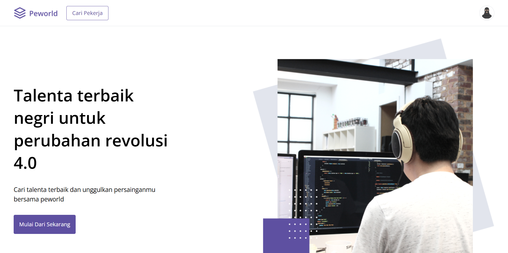
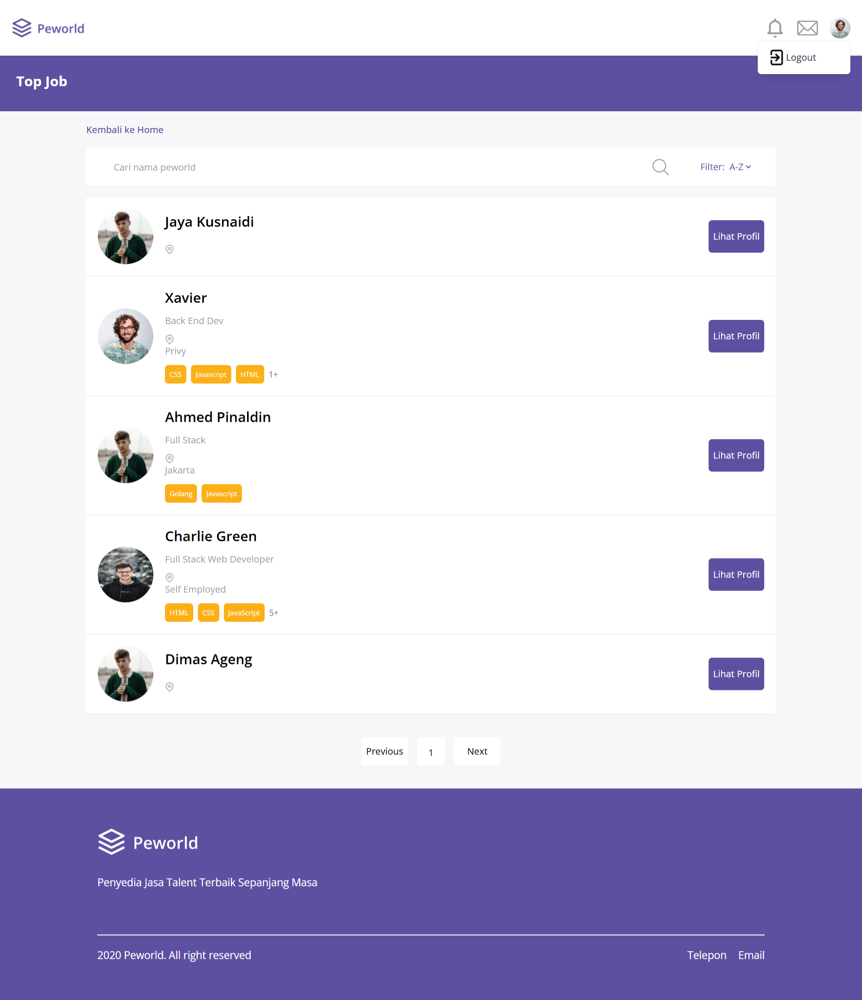
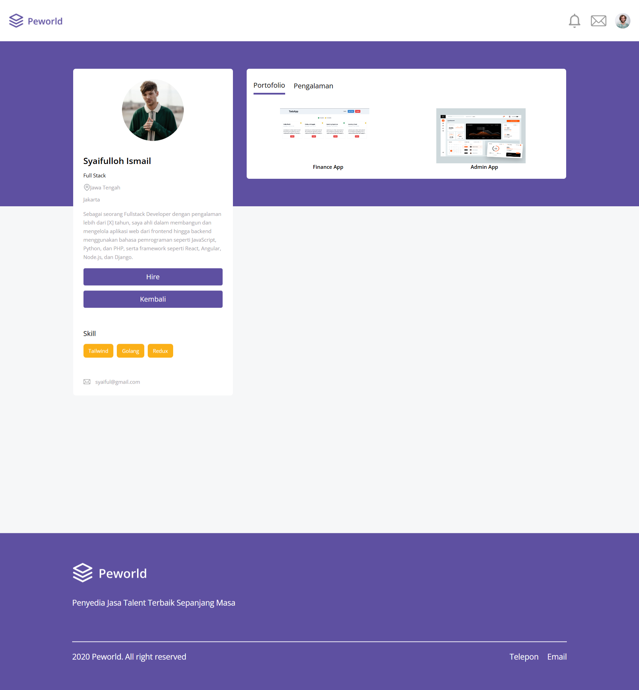
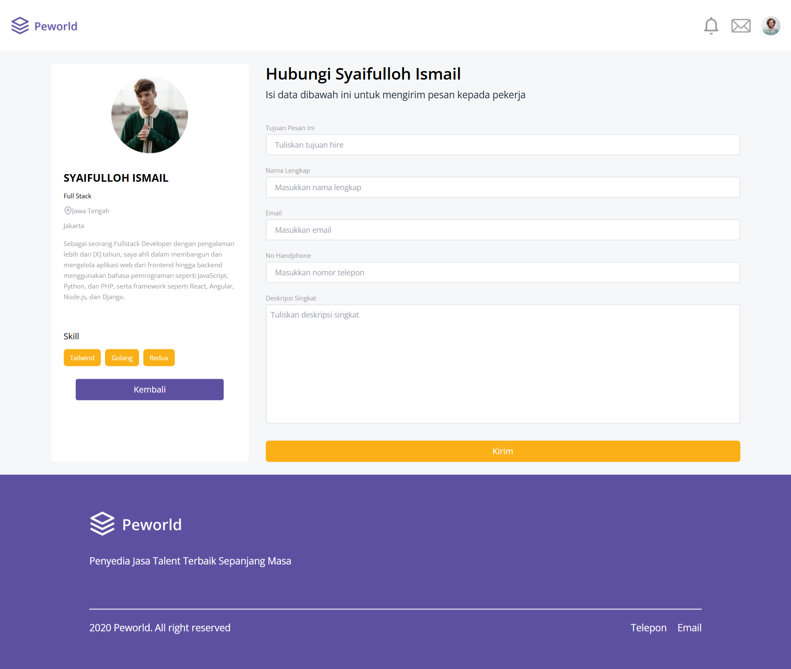
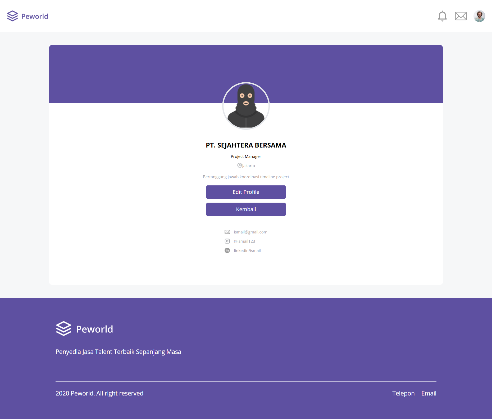
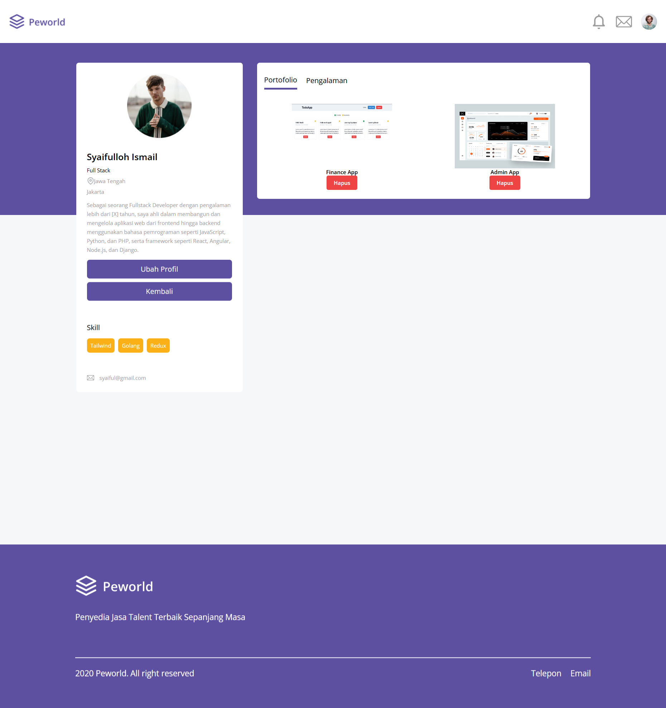
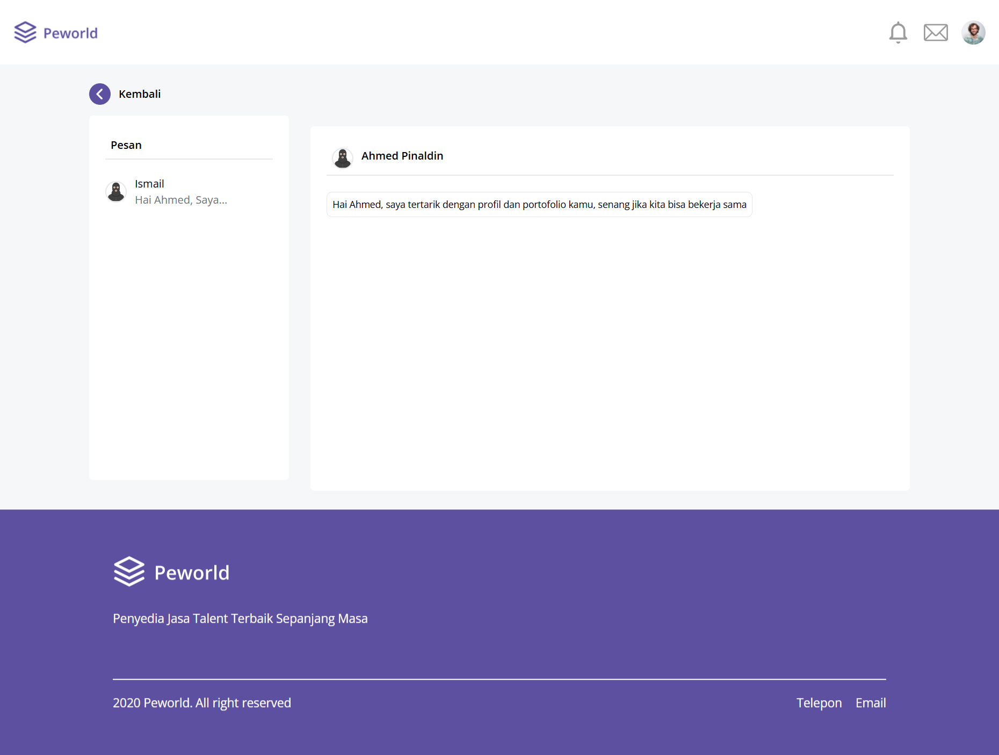

# Peworld

<p align="center">
  
</p>

## Table of Content

- [About The Project](#about-the-project)
- [Usage](#usage)
- [Installation](#installation)
- [Documentation](#documentation)
- [Visit](#visit)
- [Other References](#other-references)

## About The Project
Peworld is a job search website designed to help recruiters find the best candidates and for job seekers to find their dream job. Peworld allows recruiters to view detailed information about candidates' skills, portfolios, and experiences. It offers a "hire" feature, enabling recruiters to send direct messages to candidates if they are interested in their profiles. For job seekers, updating skills, portfolios, and experiences is crucial. Therefore, Peworld makes it easy for job seekers to update their profiles to attract more recruiters.

## Usage
This website is built using [Vite + React](https://vitejs.dev/). The web design and responsiveness are achieved with [Tailwind](https://tailwindcss.com/). For API management, the website utilizes the [Axios Library](https://axios-http.com/) to ensure neatness and efficiency. The site employs [react-redux](https://react-redux.js.org/) for state management, making the state flow cleaner, more efficient, and easier to control. For routing, the website uses the [react-router-dom](https://reactrouter.com/en/main) library to simplify the routing process.

## Installation

Steps to install and set up this project on your local machine.

1. Clone the repository:
    ```bash
    git clone https://github.com/nizuma666/Peworld.git
    ```
2. Install dependencies:
    ```bash
    npm install
    ```
    or
    ```bash
    yarn install
    ```

## Usage

- Run the following command to start the project:
    ```bash
    npm run dev
    ```
    or
    ```bash
    yarn dev
    ```

## Documentation
### 1. Landing Page
This is the first page visited when accessing Peworld.

### 2. Landing Page After Login
The navbar changes after logging in.

### 3. Login
Login will automatically detect the role according to the registered email and password.

### 4. Register
There are 2 options to register: as a recruiter or a worker.

### 5. Find Worker
This page is used to view worker information. There is a search and name filter feature that can be used to help find workers.

### 6. Profile Worker From a Recruiter Perspective
Worker profile page as seen by the recruiter. Recruiters can see all skills, portfolios, and experiences of the worker and hire by clicking the hire button.

### 7. Hire
Page for recruiters to hire workers. This page contains a form to send a hiring message to the selected worker.

### 8. Profile Recruiter
Recruiter profile page. This page contains company information from the recruiter and there is an option to edit the profile.

### 9. Profile Worker
Worker profile page. This page contains information about the worker with options to edit experience, portfolio, and profile, as well as delete a portfolio or experience.

### 10. Chat
Page to view hire messages. This page contains hire messages sent by recruiters to the targeted workers.


## Visit
If you are interested in seeing the website directly, please visit [this link](https://crud-react-tailwind-roan.vercel.app/).

## Other References
- :rocket: [HTML](https://www.duniailkom.com/tutorial-belajar-html-dan-index-artikel-html/)
- :rocket: [CSS](https://www.duniailkom.com/tutorial-belajar-css-dan-index-artikel-css/)
- :rocket: [Javascript](https://www.duniailkom.com/tutorial-belajar-javascript-dan-index-artikel-javascript/)
